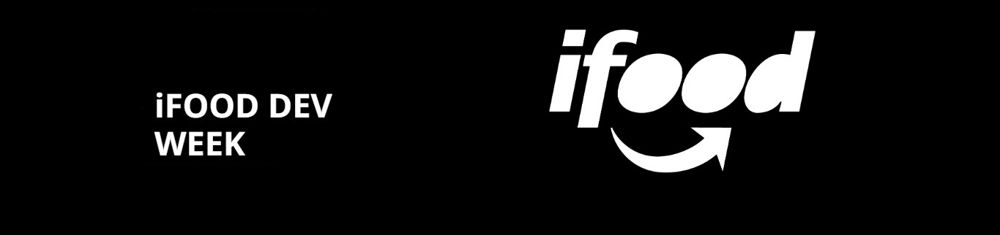

<h1 align="center">
  iFood Dev Week
</h1>

<h2 align="center">
  
</h2>

  <a href="#-projeto">🖥️ Projeto</a>&nbsp;&nbsp;&nbsp;|&nbsp;&nbsp;&nbsp;
  <a href="#-tecnologias">🚀 Tecnologias</a>&nbsp;&nbsp;&nbsp;|&nbsp;&nbsp;&nbsp;
  <a href="#-license">📝 License</a>

  

## 💻 Projeto

Projeto do evento "iFood Dev Week" da Dio junto com a iFood.

## 🚀 Tecnologias

Esse projeto foi desenvolvido com as seguintes tecnologias:

- Java
- Java Web
- Java Spring JPA
- H2 Database
- Lombok

## 📝 License

Esse projeto está sob a licença MIT. Veja o arquivo [LICENSE](LICENSE) para mais detalhes.

---
